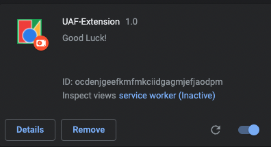

# Useless AF Extension
This project was built under NUS Hackers' Hack & Roll 2022. 

### Description
This Google Chrome Extension will help you relax after long long hackathon.
Guarantee to be one of the best extensions you have ever used. No trolling, we promise.

### Installation
Firstly, make sure you signed in to Google Chrome as the extension feature is only available for signed in users.

Follow the next 4 simple steps to install this wonderful extension:
1. Clone this repo.
```
git clone https://github.com/jushg/random-extension.git
```
2. Open chrome://extensions on your Chrome browser and enable the developer mode on the top right corner.
3. On the top left corner, choose `Load unpacked` and select the cloned repo. It should load the whole repo. You would see the extension loaded to your Chrome extensions collection.



4. Press the puzzle icon on the top left of the browser, and enjoy the extension! It should be fun!

### About Us
- [Hoang Trong Tan](https://github.com/jushg), Computer Engineering, NUS
- [Vo Quang Hung](https://github.com/hungvo0603), Computer Engineering, NUS

